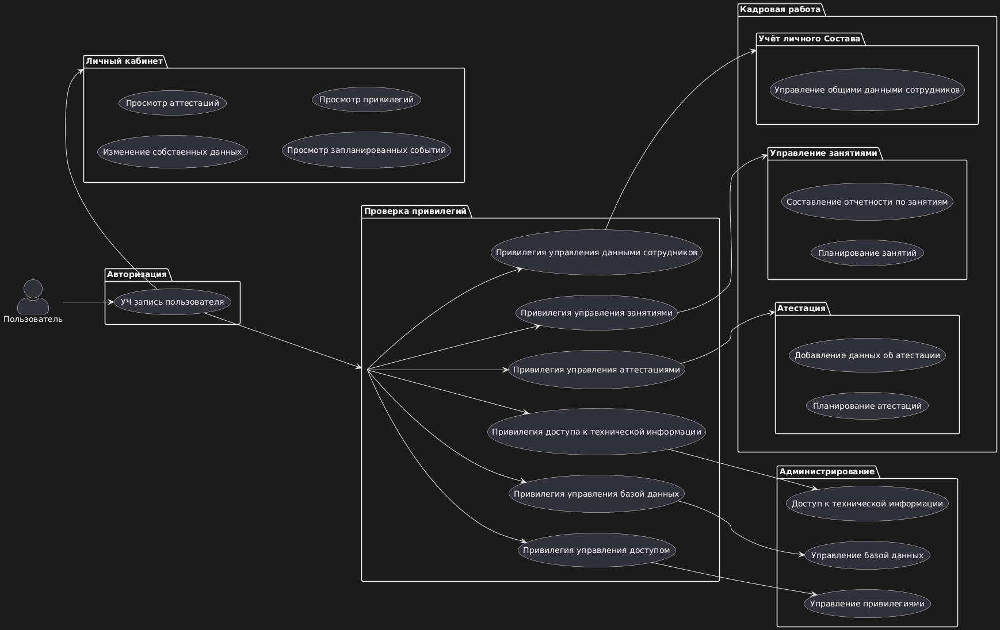

# ProjectMCHS



[google диск с тз](https://drive.google.com/drive/folders/1O8I7lcUWHXA4Z6xpvW2Tnp-mM9MzI16N)

## Запуск

Запуск только через докер.
В ./mysql/db/ нужно класть sql для создания бд.

```shell
docker compose up --build
```

Далее на [http://127.0.0.1:8000/](http://127.0.0.1:8000/) появится "hello world!".

По пути [http://127.0.0.1:8000/docs](http://127.0.0.1:8000/docs) будет
документация и доступные пути api.

При изменении файлов руками перезапускать ничего не надо.

## Credits

[wait-for](https://github.com/eficode/wait-for?tab=readme-ov-file)
