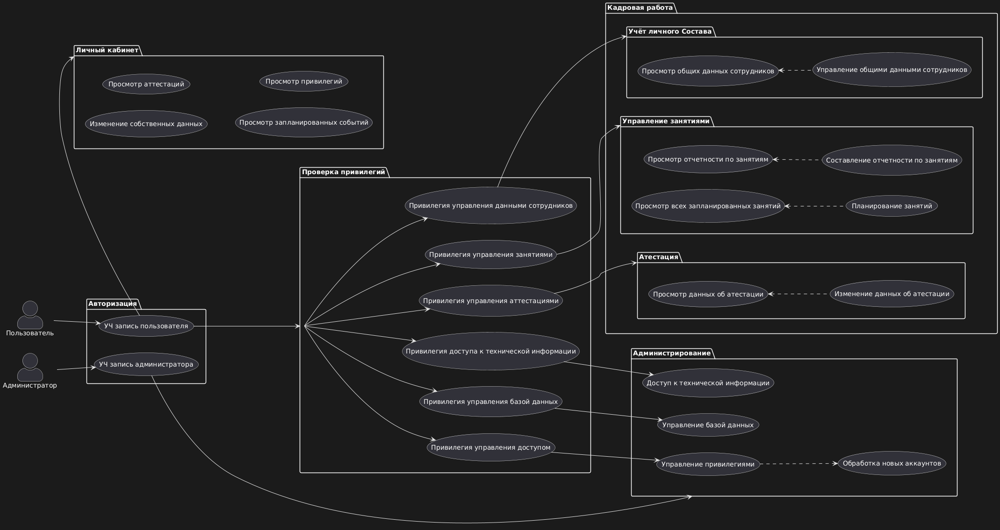

# ProjectMCHS



[google диск с тз](https://drive.google.com/drive/folders/1O8I7lcUWHXA4Z6xpvW2Tnp-mM9MzI16N)

## Запуск

Установка

1. Клонировать репозиторий:

```shell
git clone https://github.com/SemionPetrov/ProjectMCHS.git
```

2. Перейти в директорию проекта:

```shell
cd ProjectMCHS 
```
3. Запустить контейнеры:

```shell
docker compose up --build
```

Далее на [http://127.0.0.1:8000/](http://127.0.0.1:8000/) появится "hello world!".

По пути [http://127.0.0.1:8000/docs](http://127.0.0.1:8000/docs) будет
документация и доступные пути api.

На [http://localhost:8000/MCHS/index/login.html] страница входа фронтэнда.

При изменении файлов руками перезапускать ничего не надо.

## Работа с БД

Теперь таблицы создаются из файла *./api/src/database/db_models.py*.
Алгоритм изменения БД:

1. Вносим изменения в *./api/src/database/db_models.py*.
Примеров достаточно, если че гуглится по sqlalchemy models.

2. Найти *CONTAINER ID* контейнера *projectmchs-api* из:

```shell
docker ps
```

3. Сгенерировать новую миграцию:

```shel
docker exec -it  <id контейнера> alembic revision --autogenerate -m "<что изменили>"
```

4. Применить миграцию:

```shel
docker exec -it  <id контейнера> alembic upgrade head"
```

5. Можно проверить в mysql-workbench

## Credits

[wait-for](https://github.com/eficode/wait-for?tab=readme-ov-file)
